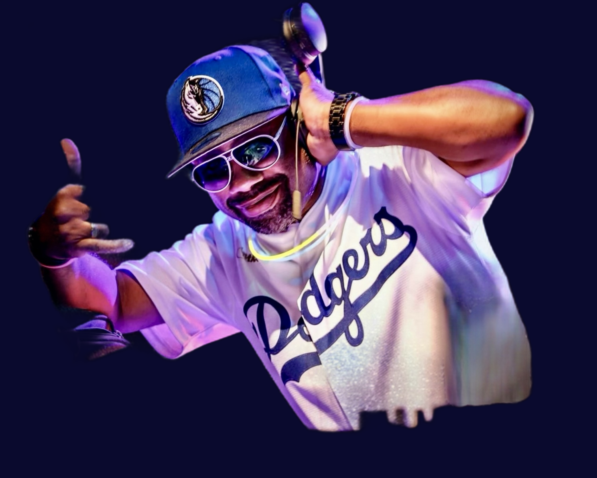

# Programme DJs par Jour — Spring Break Latino Corsica 2026
**Fichier :** `Programme_DJs_SBL2026.html`  
**Événement :** Spring Break Latino — 13 au 17 mai 2026  
**Lieu :** Camping Arinella Bianca, 20240 Ghisonnacia (Corse)  
**Dernière mise à jour :** 8 mai 2026 (v6)

---

## URL en ligne

https://jmfetienne-coder.github.io/sbl2026-djs/Programme_DJs_SBL2026.html

---

## Objet

Le programme est un affichage HTML destiné aux **festivaliers** : il permet d'identifier, jour par jour et espace par espace, quels DJs sont en cabine et à quelle heure.

Il complète le **Tombi** (`Tombi_DJs_SBL2026.html`) qui présente le roster complet des DJs avec leurs styles musicaux et dates de présence.

---

## Emplacements

| Fichier | Emplacement | Chemins photos |
|---------|-------------|----------------|
| `Programme_DJs_SBL2026.html` | `/SBL 2026/DJ_PHOTO/` | Noms de fichiers directs (ex. `DJ_Dreams2_nobg.png`) |
| `Programme_DJs_SBL2026.html` | `/SBL 2026/PLANNING/` | Préfixe `../DJ_PHOTO/` |

> Toujours ouvrir la version souhaitée directement dans un navigateur (double-clic sur le fichier).

---

## Structure de la page

### Navigation commune
Barre sticky en haut de page avec 3 onglets :
- 🎧 Trombinoscope → `Tombi_DJs_SBL2026.html`
- 📅 Programme (actif sur cette page)
- ▶ Slideshow → `Tombi_DJs_SBL2026_SLIDESHOW.html`

### En-tête
Identique au Tombi : titre de l'événement, sous-titre, dates, lieu.

### Légende espaces
Cinq espaces codés couleur :

| Couleur | Espace |
|---------|--------|
| 🟠 Orange | Espace Caraïbes (Salsa / Porto / Calena) |
| 🩷 Rose | Espace Bachata (Trad / Sensual / Moderne) |
| 🟢 Vert | Espace Suave / Kizomba |
| 🟣 Violet foncé | After Party — Kizomba (Park Place) |
| 🟣 Violet | After Party — Playa (Afro / Généraliste) |

### Sections par jour (5 jours)

Chaque section comprend :

1. **En-tête du jour** : nom, date, horaires, dress-code, événements spéciaux de la journée
2. **En-tête de grille** : colonnes Horaire · Caraïbes · Bachata · Suave · After Kiz · After Playa
3. **Lignes événements spéciaux** : Pool Party, Beach Party, Showcases, Concerts — ligne pleine largeur avec DJ et description
4. **Section « Sur les pistes »** : sur chaque ligne concert, affichage des DJs et styles disponibles simultanément sur les espaces dansants (styles complémentaires au concert en cours)
5. **Lignes de créneaux** : chaque créneau de 2h montre les duos de DJs par espace sous forme d'avatars circulaires (photo + nom)

---

## Contenu par jour

### Mercredi 13 Mai
- Dress-code : 🎽 Tee-shirt SBL
- Soirée : 22h00 → 04h00

| Créneau | Caraïbes | Bachata | Suave / Kiz | After Kiz | After Playa |
|---------|----------|---------|-------------|-----------|-------------|
| 22h-00h | Alex Salderito + Philippe DJ | Jean-Michel + Jean-Emile | DJ TREW + CyCy | — | — |
| 00h-02h | Rolland + Jérémy | Sylvain + Philippe DJ | Mikado San + Jean-Emile | — | — |
| 02h-04h | — | — | — | DREAMS + Fabulous DJ | DREAMS + Rolland |

---

### Jeudi 14 Mai
- Dress-code : 🎭 Carnaval Brésilien
- Journée : 🏊 Pool Party 14h-17h (DREAMS)
- Showcase : 🎤 Mika Mendes (sur Scène, 21h-23h)
- Soirée : 21h00 → 04h00

| Créneau | Caraïbes | Bachata | Suave / Kiz | After Kiz | After Playa |
|---------|----------|---------|-------------|-----------|-------------|
| 21h-23h | Alex Salderito + Jérémy | Sylvain + Philippe DJ | DJ TREW + Jean-Emile | — | — |
| 23h-02h | Rolland + Philippe DJ | Jean-Michel + Jean-Emile | Mikado San + DJ TREW | — | — |
| 02h-04h | — | — | — | CyCy + DJ TREW | DREAMS + Fabulous DJ |

**Pendant le showcase Mika Mendes (21h-23h) — Sur les pistes :**
- 🟠 **Salsa** : Alex Salderito + Jérémy (Espace Caraïbes)
- 🩷 **Bachata** : Sylvain + Philippe DJ (Espace Bachata)

---

### Vendredi 15 Mai
- Dress-code : 🪩 Disco Party
- Concert : 🎸 Bachata — Grupo Olas (sur Scène, 21h-23h)
- Soirée : 21h00 → 04h00

| Créneau | Caraïbes | Bachata | Suave / Kiz | After Kiz | After Playa |
|---------|----------|---------|-------------|-----------|-------------|
| 21h-23h | Alex Salderito + Jérémy | Jean-Michel + Philippe DJ | DJ TREW + CyCy | — | — |
| 23h-02h | Rolland + Philippe DJ | Sylvain + Jean-Emile | Mikado San + DJ TREW | — | — |
| 02h-04h | — | — | — | CyCy + Jean-Emile | DREAMS + Fabulous DJ |

**Pendant le concert Grupo Olas / Bachata (21h-23h) — Sur les pistes :**
- 🟠 **Salsa** : Alex Salderito + Jérémy (Espace Caraïbes)
- 🟢 **Kizomba** : DJ TREW + CyCy (Espace Suave)

---

### Samedi 16 Mai
- Dress-code : 🤍 Chic & Blanc
- Journée : 🏖️ Beach Party X Games 14h-18h (DREAMS)
- Concert : 🎺 Salsa — Parisongo (sur Scène, 21h-22h30)
- Espace Caraïbes ouvre à 22h30
- Soirée : 21h00 → 04h+

| Créneau | Caraïbes | Bachata | Suave / Kiz | After Kiz | After Playa |
|---------|----------|---------|-------------|-----------|-------------|
| 21h-22h30 | — (concert) | Jean-Michel + Jean-Emile | DJ TREW + CyCy | — | — |
| 22h30-02h | Alex Salderito + Rolland | Sylvain + Philippe DJ | Mikado San + Jean-Emile | — | — |
| 02h+ | — | — | — | DJ TREW + Mikado San | DREAMS + Fabulous DJ |

**Pendant le concert Parisongo / Salsa (21h-22h30) — Sur les pistes :**
- 🟢 **Kizomba** : DJ TREW + CyCy (Espace Suave)
- 🩷 **Bachata** : Jean-Michel + Jean-Emile (Espace Bachata)

---

### Dimanche 17 Mai
- Soirée SBK — Salsa · Bachata · Kizomba
- Début : 19h00 → Nuit
- ⚠️ Jean-Emile reparti à 15h00 — non disponible

| Créneau | Caraïbes | Bachata | Suave / Kiz |
|---------|----------|---------|-------------|
| 19h+ | Alex Salderito + Jérémy | Jean-Michel + Philippe DJ | DJ TREW + Mikado San |
| Nuit+ | Rolland + Alex Salderito | Sylvain + Philippe DJ | CyCy + DJ TREW |

> DREAMS disponible en renfort si besoin.

---

## Avatars DJs

Chaque DJ apparaît sous forme d'avatar circulaire (38px) + nom. Les fichiers utilisés sont les versions sans fond (`_nobg.png`) :

| DJ (nom affiché) | Fichier photo |
|------------------|---------------|
| DJ DREAMS | `DJ_Dreams2_nobg.png` |
| DJ Alex Salsarito | `DJ_SALSERITO_nobg.png` |
| DJ PHILIPPE | `DJ_PHILIPPE_nobg.png` |
| DJ Jean-Mi | `DJ_JEAN-MICHELJPG_nobg.png` |
| DJ Jean-Emile | `DJ_Jean_Emile_nobg.png` |
| DJ TREW | `DJ_THOMAS_nobg.png` |
| DJ CYCY | `DJ_CyCy_nobg.png` |
| DJ BLANQUILLO | `DJ_SYLVAIN_nobg.png` |
| DJ Mikado San | `DJ_Mikado_nobg.png` |
| DJ ROH | `DJ_RO_nobg.png` |
| DJ JEREMY | `DJ_JEREMY_nobg.png` |
| DJ FABULOUS | `DJ_FABULOUS_nobg.png` |

---

## Comment modifier le programme

### Changer un duo de DJs dans un créneau

Repérer le bloc HTML correspondant au jour + créneau + espace. Chaque cellule suit ce schéma :

```html
<div class="slot-cell">
  <div class="dj-mini">
    
    <span class="dj-name">Alex Salderito</span>
  </div>
  <div class="dj-plus">+</div>
  <div class="dj-mini">
    
    <span class="dj-name">Philippe DJ</span>
  </div>
</div>
```

Remplacer le `src` et le texte du `<span class="dj-name">` pour chaque DJ du duo.

### Cellule vide (espace non couvert)

```html
<div class="slot-cell empty"></div>
```

### Synchroniser les deux copies

Après modification de la version DJ_PHOTO, régénérer la version PLANNING :

```bash
sed 's|src="DJ_|src="../DJ_PHOTO/DJ_|g' \
  "DJ_PHOTO/Programme_DJs_SBL2026.html" \
  > "PLANNING/Programme_DJs_SBL2026.html"
```

---

## Fichiers associés

| Fichier | Emplacement | Description |
|---------|-------------|-------------|
| `Tombi_DJs_SBL2026.html` | `/SBL 2026/DJ_PHOTO/` | Roster complet des DJs (styles, espaces, dates) |
| `Planning_DJs_SBL2026.xlsx` | `/SBL 2026/PLANNING/` | Source du planning (feuille « Planning DJs Soirées ») |
| `README_DJ_PHOTO.md` | `/SBL 2026/DJ_PHOTO/` | Inventaire des photos |
| `README_Planning_DJs_SBL2026.md` | `/SBL 2026/PLANNING/` | Documentation du planning général |

---

## Historique des mises à jour

| Date | Modification |
|------|-------------|
| 8 mai 2026 | Création v1 — 5 jours, grille créneaux × espaces, avatars DJs, événements spéciaux |
| 8 mai 2026 | v2 — Amélioration design (animations CSS, glow, zoom photo, lumières ambiantes) |
| 8 mai 2026 | v2 — Ajout section «Sur les pistes» sur les 3 lignes concert (Mika Mendes, Grupo Olas, Parisongo) |
| 8 mai 2026 | v3 — Renommage affiché de tous les DJs (DJ DREAMS, DJ BLANQUILLO, DJ CYCY, DJ Jean-Mi, DJ ROH, DJ PHILIPPE, DJ JEREMY, DJ TREW, DJ Mikado San, DJ Alex Salsarito, DJ FABULOUS, DJ Jean-Emile) |
| 8 mai 2026 | v4 — Intégration photo `DJ_Jean_Emile_nobg.png` — avatar SVG remplacé dans toutes les occurrences |
| 8 mai 2026 | v5 — Navigation commune 3 onglets (Trombinoscope · Programme · Slideshow) en barre sticky |
| 8 mai 2026 | v6 — Mise en ligne GitHub Pages (dépôt `jmfetienne-coder/sbl2026-djs`) |
| 9 mai 2026 | v7 — DJ RO renommé **DJ ROH** (avec H) |
| 9 mai 2026 | v8 — DJ FABULOUS : styles musicaux mis à jour (10 genres) |
| 9 mai 2026 | v9 — DJ JEREMY : Bachata ajouté · DJ FABULOUS / DJ ROH / DJ PHILIPPE : Pool Party + Beach Party ajoutés |
| 9 mai 2026 | v10 — Corrections structurelles planning : soirées 22h-02h · after 02h-04h · Suave fermé pendant showcase jeudi · Bachata fermé pendant concert vendredi · Caraïbes fermé pendant concert samedi · Pratiques sociales 17h30-19h (Jeu/Ven/Sam) · Dimanche : Apéro géant + Soirée SBK DOME · Pas d'after dimanche |

---

*Spring Break Latino Corsica 2026 · by Salsabor · inforesa@salsabor.fr*
