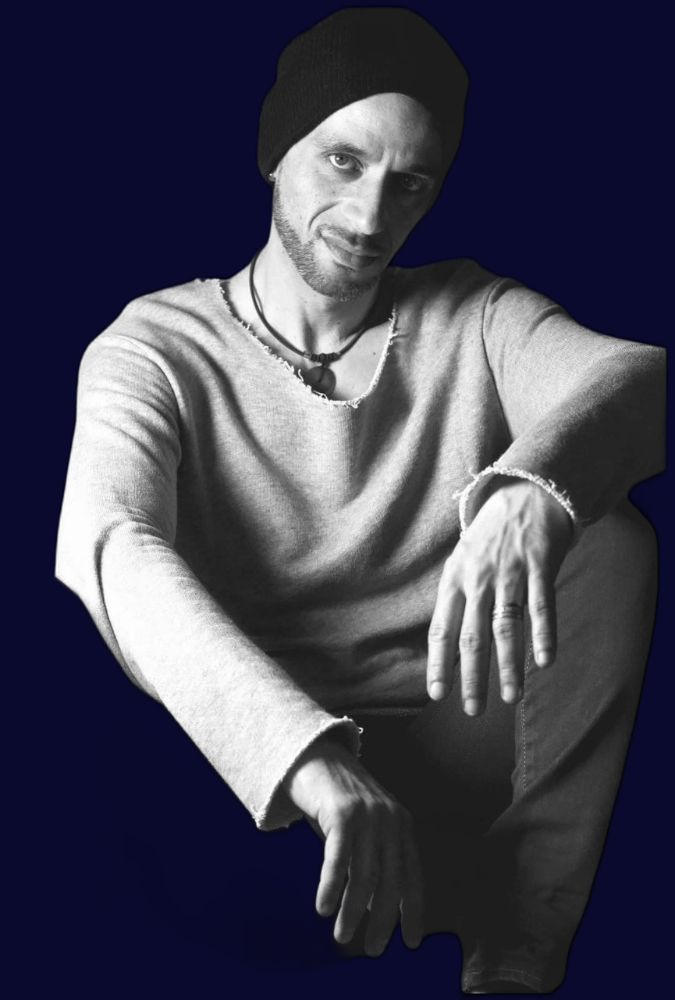
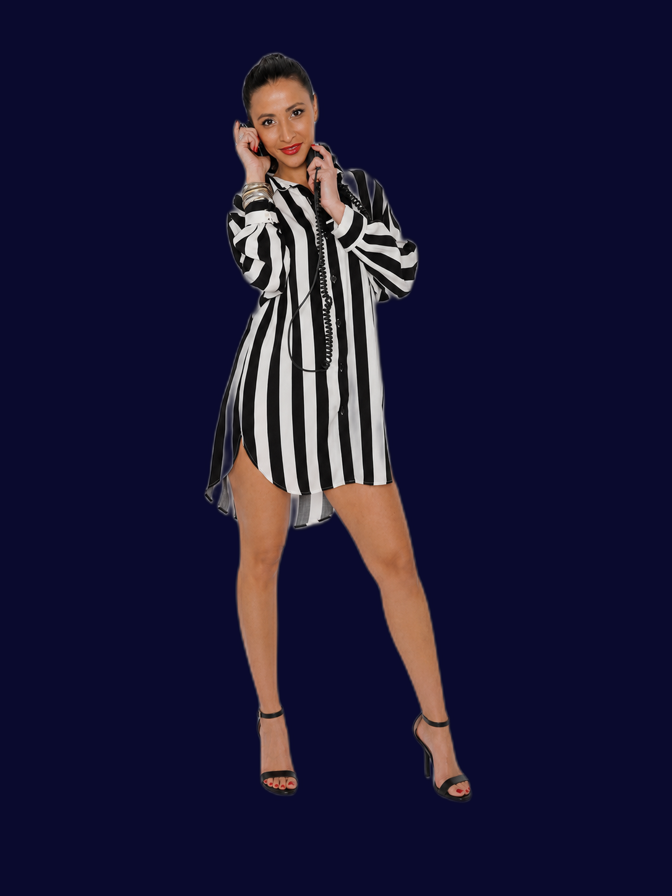
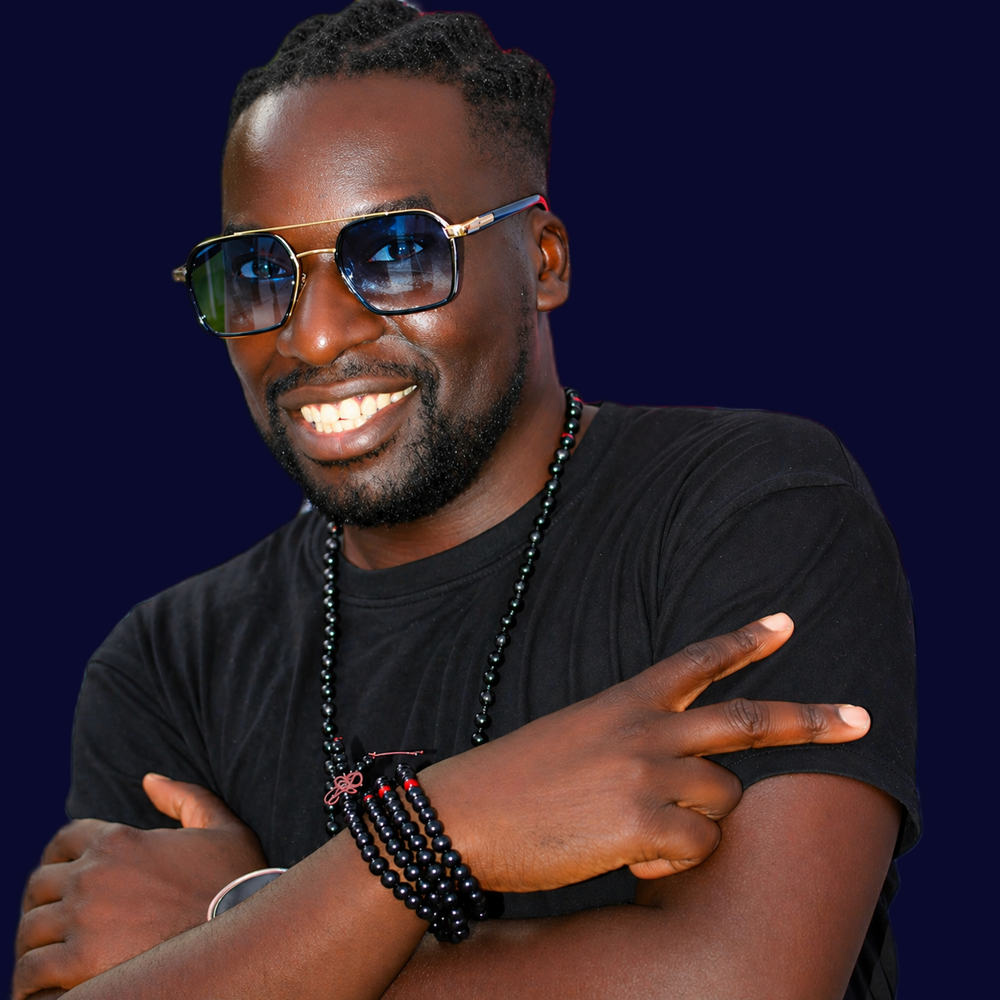
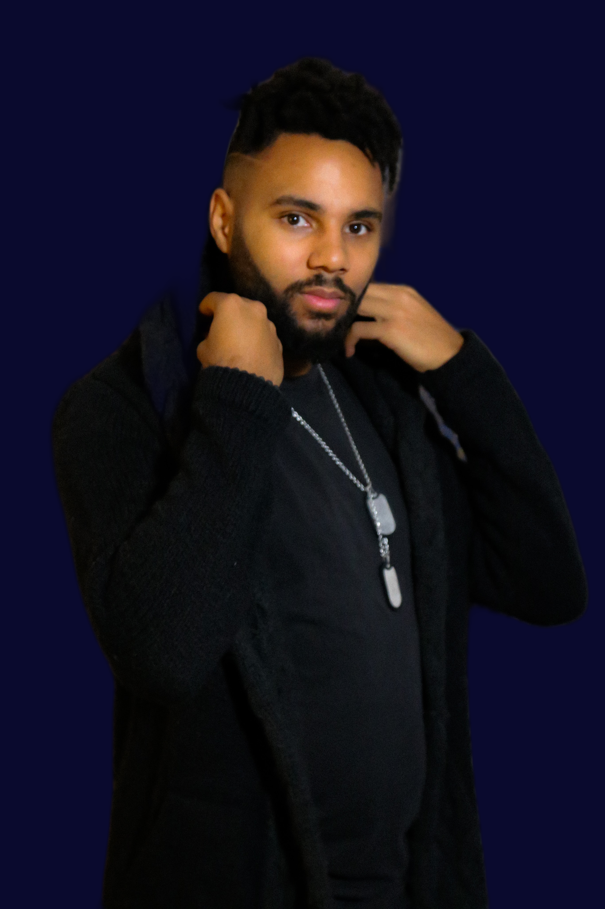

# Programme DJs par Jour — Spring Break Latino Corsica 2026
**Fichier :** `Programme_DJs_SBL2026.html`  
**Événement :** Spring Break Latino — 13 au 17 mai 2026  
**Lieu :** Camping Arinella Bianca, 20240 Ghisonnacia (Corse)  
**Dernière mise à jour :** 16 mai 2026 (v15)

---

## URL en ligne

https://jmfetienne-coder.github.io/sbl2026-djs/Programme_DJs_SBL2026.html

---

## Objet

Le programme est un affichage HTML destiné aux **festivaliers** : il permet d'identifier, jour par jour et espace par espace, quels DJs sont en cabine et à quelle heure.

Il complète le **Tombi** (`Tombi_DJs_SBL2026.html`) qui présente le roster complet des DJs avec leurs styles musicaux et dates de présence.

---

## Emplacements

| Fichier | Emplacement | Chemins photos |
|---------|-------------|----------------|
| `Programme_DJs_SBL2026.html` | `/SBL 2026/DJ_PHOTO/` | Noms de fichiers directs (ex. `DJ_Dreams2_nobg.png`) |
| `Programme_DJs_SBL2026.html` | `/SBL 2026/PLANNING/` | Préfixe `../DJ_PHOTO/` |

> Pour ouvrir localement sans problème d'affichage des photos, utiliser l'URL GitHub Pages ci-dessus, ou lancer un serveur local : `python3 -m http.server 8000` depuis le dossier `DJ_PHOTO/`.

---

## Structure de la page

### Navigation commune
Barre sticky en haut de page avec 3 onglets :
- 🎧 Trombinoscope → `Tombi_DJs_SBL2026.html`
- 📅 Programme (actif sur cette page)
- ▶ Slideshow → `Tombi_DJs_SBL2026_SLIDESHOW.html`

### En-tête
Titre de l'événement, sous-titre, dates, lieu.

### Légende espaces

| Couleur | Espace |
|---------|--------|
| 🟠 Orange | **DOME** — Espace Caraïbes (Salsa / Porto / Calena) |
| 🟢 Vert | **Kizomba / Suave** |
| 🩷 Rose | **Bachata / Kizomba** |

### Sections par jour (5 jours)

Chaque section comprend :

1. **En-tête du jour** : nom, date, horaires, dress-code, événements spéciaux
2. **En-tête de grille** : Horaire · DOME · Kizomba Suave · Bachata Kizomba
3. **Lignes événements spéciaux** : Pool Party, Beach Party, Pratiques Sociales, Concerts
4. **Section « Sur les pistes »** : DJs disponibles sur les espaces dansants pendant les concerts
5. **Lignes de créneaux 1h** : avatars circulaires (photo + nom), séparateur `/` entre deux DJs qui se partagent un créneau
6. **After Party 02h-04h** : deux espaces — Playa (généraliste) et Kizomba — Park Place (Espace Bachata)

---

## Contenu par jour

### Mercredi 13 Mai
- Dress-code : 🎽 Tee-shirt SBL
- Soirée : 22h00 → 04h00 · **DJ DREAMS** (Ouverture officielle)

| Créneau | DOME | Kizomba / Suave | Bachata / Kizomba |
|---------|------|-----------------|-------------------|
| 22h-23h | DJ JEREMY / DJ CYCY | DJ Mikado San | DJ BLANQUILLO |
| 23h-00h | DJ CYCY / DJ JEREMY | **DJ MOJO** | DJ BLANQUILLO |
| 00h-01h | DJ PHILIPPE / DJ Jean-Mi | DJ TREW | DJ FABULOUS |
| 01h-02h | DJ Jean-Mi / DJ PHILIPPE | **DJ MOJO** | DJ FABULOUS |
| **After Party 02h-04h** | — | **Playa** : DJ PHILIPPE + DJ ROH | **Kizomba — Park Place** : DJ TREW + DJ FABULOUS |

---

### Jeudi 14 Mai
- Dress-code : 🎭 Carnaval Brésilien
- Journée : 🏊 Pool Party 14h-17h — **DJ DREAMS + DJ FABULOUS**
- Pratiques Sociales : 17h30-19h00
- Showcase : 🎤 Mika Mendes (sur Scène, 21h-23h)
- Soirée : 21h00 → 04h00

**Pratiques Sociales 17h30-19h :**
- 🟢 **Kizomba** — Park Place : DJ TREW
- 🟠 **Salsa · Bachata** — Playa : DJ Jean-Mi

| Créneau | DOME | Kizomba / Suave | Bachata / Kizomba |
|---------|------|-----------------|-------------------|
| 21h-23h | *(DOME fermé — Showcase)* | **Bachata — Park Place** : **DJ FABULOUS** | **Caraïbes — Playa** : DJ Alex Salserito |
| 23h-00h | DJ DREAMS / DJ CYCY | DJ Mikado San | DJ BLANQUILLO |
| 00h-01h | DJ CYCY / DJ DREAMS | **DJ MOJO** | DJ BLANQUILLO |
| 01h-02h | DJ PHILIPPE | DJ TREW | DJ FABULOUS |
| **After Party 02h-04h** | — | **Playa** : DJ DREAMS + DJ FABULOUS | **Kizomba — Park Place** : DJ Mikado San + DJ TREW |

**Pendant le showcase Mika Mendes (21h-23h) — Sur les pistes :**
- 🟠 **Caraïbes** : DJ Alex Salserito (Playa)
- 🩷 **Bachata** : DJ FABULOUS (Park Place)

---

### Vendredi 15 Mai
- Dress-code : 🪩 Disco Party
- Pratiques Sociales : 17h30-19h00
- Concert : 🎸 Bachata — Grupo Olas (sur Scène, 21h-23h)
- Soirée : 21h00 → 04h00

**Pratiques Sociales 17h30-19h :**
- 🟢 **Kizomba** — Park Place : DJ Mikado San
- 🟠 **Salsa · Bachata** — Playa : DJ Alex Salserito

| Créneau | DOME | Kizomba / Suave | Bachata / Kizomba |
|---------|------|-----------------|-------------------|
| 21h-23h | *(DOME fermé — Concert Bachata)* | **Caraïbes — Playa** : DJ Alex Salserito | **Suave — Park Place** : DJ TREW |
| 23h-00h | DJ Jean-Mi / DJ FABULOUS | **DJ MOJO** | DJ BLANQUILLO |
| 00h-01h | DJ PHILIPPE / DJ Jean-Mi | DJ Mikado San | DJ BLANQUILLO |
| 01h-02h | DJ PHILIPPE | DJ TREW | DJ FABULOUS |
| **After Party 02h-04h** | — | **Playa** : DJ DREAMS + DJ FABULOUS + DJ ROH | **Kizomba — Park Place** : DJ TREW + DJ Alex Salserito |

**Pendant le concert Grupo Olas / Bachata (21h-23h) — Sur les pistes :**
- 🟠 **Caraïbes** : DJ Alex Salserito (Playa)
- 🟢 **Suave** : DJ TREW (Park Place)

---

### Samedi 16 Mai
- Dress-code : 🤍 Chic & Blanc
- Journée : 🏖️ Beach Party X Games 14h-18h — **DJ DREAMS + DJ ROH**
- Pratiques Sociales : 17h30-19h00
- Concert : 🎺 Salsa — Parisongo (sur Scène, 21h30-22h30)
- Espace Caraïbes (DOME) ouvre à 22h30
- Soirée : 21h30 → 04h+

**Pratiques Sociales 17h30-19h :**
- 🟢 **Kizomba** — Park Place : DJ TREW
- 🟠 **Salsa · Bachata** — Playa : DJ JEREMY

| Créneau | DOME | Kizomba / Suave | Bachata / Kizomba |
|---------|------|-----------------|-------------------|
| 21h30-22h30 | 🎺 *Fermé — Concert Salsa* | **Suave — Playa** : DJ TREW | **Bachata — Park Place** : **DJ MOJO** |
| 22h30-00h | DJ CYCY / DJ Alex Salserito | DJ TREW | DJ BLANQUILLO |
| 00h-01h | DJ Alex Salserito / DJ CYCY | DJ Mikado San | DJ FABULOUS |
| 01h-02h | DJ CYCY / DJ PHILIPPE | **DJ MOJO** | DJ FABULOUS |
| **After Party 02h-04h+** | — | **Playa** : DJ DREAMS + DJ FABULOUS + DJ PHILIPPE | **Kizomba — Park Place** : DJ TREW + DJ Mikado San + DJ Alex Salserito |

**Pendant le concert Parisongo / Salsa (21h30-22h30) — Sur les pistes :**
- 🟢 **Suave** : DJ TREW (Playa)
- 🩷 **Bachata** : DJ MOJO (Park Place)

---

### Dimanche 17 Mai
- Soirée SBK — Salsa · Bachata · Kizomba
- Apéro géant → Soirée dansante · DOME · à partir de 19h00
- Pas d'After Party
- ⚠️ DJ MOJO reparti à 15h00 — non disponible

| Créneau | DOME | Kizomba / Suave | Bachata / Kizomba |
|---------|------|-----------------|-------------------|
| 19h+ | DJ Alex Salserito + DJ CYCY | DJ Jean-Mi + DJ PHILIPPE | DJ TREW + DJ Mikado San |
| Nuit+ | DJ ROH + DJ JEREMY | DJ BLANQUILLO + DJ PHILIPPE | DJ FABULOUS + DJ TREW |

> DJ DREAMS disponible en renfort si besoin.

---

## Avatars DJs

Chaque DJ apparaît sous forme d'avatar circulaire (38px) + nom. Fichiers utilisés (versions sans fond `_nobg.png`) :

| DJ (nom affiché) | Fichier photo |
|------------------|---------------|
| DJ DREAMS | `DJ_Dreams2_nobg.png` |
| DJ Alex Salserito | `DJ_SALSERITO_nobg.png` |
| DJ MOJO | `DJ_Jean_Emile_nobg.png` |
| DJ PHILIPPE | `DJ_PHILIPPE_nobg.png` |
| DJ Jean-Mi | `DJ_JEAN-MICHELJPG_nobg.png` |
| DJ MOJO | `DJ_Jean_Emile_nobg.png` |
| DJ TREW | `DJ_THOMAS_nobg.png` |
| DJ CYCY | `DJ_CyCy_nobg.png` |
| DJ BLANQUILLO | `DJ_SYLVAIN_nobg.png` |
| DJ Mikado San | `DJ_Mikado_nobg.png` |
| DJ ROH | `DJ_RO_nobg.png` |
| DJ JEREMY | `DJ_JEREMY_nobg.png` |
| DJ FABULOUS | `DJ_FABULOUS_nobg.png` |

---

## Comment modifier le programme

### Créneau avec deux DJs en alternance (séparateur `/`)

```html
<div class="slot-cell">
  <div class="dj-mini">
    
    <span class="dj-name">DJ JEREMY</span>
  </div>
  <div class="dj-plus">/</div>
  <div class="dj-mini">
    
    <span class="dj-name">DJ CYCY</span>
  </div>
</div>
```

### Créneau avec un seul DJ

```html
<div class="slot-cell">
  <div class="dj-mini">
    
    <span class="dj-name">DJ PHILIPPE</span>
  </div>
</div>
```

### Cellule vide (espace non couvert)

```html
<div class="slot-cell empty"></div>
```

### Cellule avec label de lieu (After Party / concert)

```html
<div class="slot-cell" style="flex-direction:column;align-items:flex-start;gap:6px;">
  <div style="font-size:.55em;color:#00695C;font-weight:700;text-transform:uppercase;letter-spacing:.8px;">After Party Kizomba — Park Place</div>
  <div class="dj-mini">
    
    <span class="dj-name">DJ TREW</span>
  </div>
</div>
```

### Synchroniser les deux copies

Après modification de la version DJ_PHOTO, régénérer la version PLANNING :

```bash
sed 's|src="DJ_|src="../DJ_PHOTO/DJ_|g; s|src="SBL_|src="../DJ_PHOTO/SBL_|g' \
  "DJ_PHOTO/Programme_DJs_SBL2026.html" \
  > "PLANNING/Programme_DJs_SBL2026.html"
```

---

## Fichiers associés

| Fichier | Emplacement | Description |
|---------|-------------|-------------|
| `Tombi_DJs_SBL2026.html` | `/SBL 2026/DJ_PHOTO/` | Roster complet des DJs (styles, espaces, dates) |
| `Tombi_DJs_SBL2026_SLIDESHOW.html` | `/SBL 2026/DJ_PHOTO/` | Slideshow animé plein écran |
| `Planning_DJs_SBL2026.xlsx` | `/SBL 2026/PLANNING/` | Source du planning (feuille « Planning DJs Soirées ») |
| `README_DJ_PHOTO.md` | `/SBL 2026/DJ_PHOTO/` | Inventaire des photos |
| `README_Planning_DJs_SBL2026.md` | `/SBL 2026/PLANNING/` | Documentation du planning général |

---

## Historique des mises à jour

| Date | Version | Modification |
|------|---------|-------------|
| 8 mai 2026 | v1 | Création — 5 jours, grille créneaux × espaces, avatars DJs, événements spéciaux |
| 8 mai 2026 | v2 | Design amélioré (animations CSS, glow, zoom photo, lumières ambiantes) · section «Sur les pistes» |
| 8 mai 2026 | v3 | Renommage affiché de tous les DJs |
| 8 mai 2026 | v4 | Intégration photo `DJ_Jean_Emile_nobg.png` |
| 8 mai 2026 | v5 | Navigation commune 3 onglets (sticky) |
| 8 mai 2026 | v6 | Mise en ligne GitHub Pages |
| 9 mai 2026 | v7 | DJ RO → **DJ ROH** |
| 9 mai 2026 | v8 | DJ FABULOUS : styles mis à jour (10 genres) |
| 9 mai 2026 | v9 | DJ JEREMY : Bachata · Pool Party + Beach Party (FABULOUS/ROH/PHILIPPE) |
| 9 mai 2026 | v10 | Corrections structurelles planning (15 points) |
| 9 mai 2026 | v11 | Audit cohérence musicale — 13 corrections · DJ CYCY exclusivement Caraïbes/Bachata |
| 9 mai 2026 | v12 | Pratiques Sociales 17h30-19h ajoutées (Jeu/Ven/Sam) |
| 10 mai 2026 | v13 | **Refonte complète** : créneaux **1h** · **3 colonnes** (DOME / Kizomba Suave / Bachata Kizomba) · After Party 02h-04h restaurés (Playa + Kizomba Park Place) pour Mer/Jeu/Ven · Samedi 02h-04h+ |
| 13 mai 2026 | v14 | **DJ Jean-Emile renommé DJ MOJO** partout · **Salsarito → Salserito** (correction orthographe) · Styles Salserito reordonnés (Zouk/Konpa/Konpa Gouyad en tête + Bachata) · **Pool Party Jeudi** : +DJ FABULOUS · **Beach Party Samedi** : +DJ ROH · **Ouverture Mercredi** : DJ DREAMS ajouté · **Logo SBL** ajouté en watermark (header 3 pages + cartes Tombi) · Mercredi 23h-00h Kiz : Mikado San→MOJO · Mercredi 01h-02h Kiz : TREW→MOJO · Jeudi 21h-23h Bachata Park Place : MOJO→FABULOUS · Jeudi 00h-01h Kiz : Mikado San→MOJO · Jeudi 01h-02h Bachata : MOJO→FABULOUS · Vendredi 23h-00h Kiz : Mikado San→MOJO · Vendredi 00h-01h Bachata : MOJO→BLANQUILLO · Vendredi 01h-02h Bachata : MOJO→FABULOUS · Samedi 21h30-22h30 : DOME fermé (Concert Salsa) + MOJO à Bachata Park Place · Samedi 01h-02h Kiz : Mikado San→MOJO · Samedi After Party Park Place : BLANQUILLO→Alex Salserito · Dimanche : CYCY ↔ JEREMY inversés |
| 16 mai 2026 | v15 | **Vendredi 21h-23h DOME fermé** (Concert Bachata Grupo Olas — DJ JEREMY / DJ PHILIPPE supprimés) · **Samedi 01h-02h DOME** : DJ DREAMS → DJ CYCY |

---

*Spring Break Latino Corsica 2026 · by Salsabor · inforesa@salsabor.fr*
